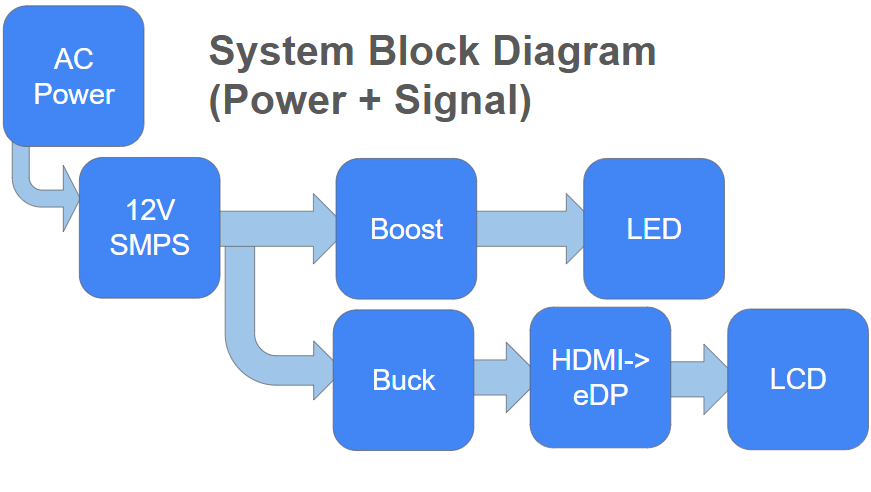

Lumina-FHD 
High-Flux DIY Transmissive LCD Projector

The Lowdown
Lumina-FHD is a high-brightness DIY projector that's all about creating a sharp 100-inch Full HD image using a 15.6" laptop LCD panel. The focus is on the optics, thermal control, and power electronics.
The goal is to squeeze out a huge amount of light from the LCD while keeping everything nice and cool, especially the sensitive LCD polarizers. This project is a part of the HackClub Blueprint program.

The Guts of It
The Optical System
I'm using a dual-Fresnel design:
Light Source: A high-power COB LED (100W), running on 6500K (neutral white)
Primary Condenser: A 44mm glass aspheric lens (60 degrees)
Rear Fresnel (Collimator): A special A3-format Fresnel lens to get the light in line
LCD Panel: An Innolux N156HCA-EN1 15.6" FHD display
Front Fresnel (Field Lens): Another A3-format Fresnel lens to get the image looking sharp
Projection Optics: A F240 glass triplet lens to put it all together
This setup gets the most light possible while keeping the image nice and even.

Cooling Down
Thermal management is super important - I'm treating it like a first-class citizen from the get-go.
I'm using a 240mm liquid cooling loop (an AIO cooler) to keep the LED cool
A high-static-pressure 140mm fan is blowing air across to manage airflow across the optical path
I'm testing this on an open-frame rig first to make sure airflow and temperature are under control before I start building an enclosure.

Powering Up
I'm running from a single AC-DC power supply with a bunch of DC rails:
The primary power source is a 12V 10A SMPS
I've got a DC-DC boost converter to power that LED at its required voltage
A DC-DC buck converter (LM2596) to power the low-voltage logic and control electronics
And an HDMI-to-eDP controller board to hook up to any HDMI source I like
What I Need to Buy
Here's a quick rundown of what I'm looking for for each subsystem:
| Subsystem | Key Components |
|----------|----------------|
| Light Engine | High-power COB LED, aspheric condenser |
| Display | Innolux N156HCA-EN1 15.6" FHD LCD |
| Optics | F240 triplet lens, dual A3 Fresnel lenses |
| Cooling | 240mm liquid cooler, 140mm high-pressure fan |
| Power | 12V SMPS, boost & buck converters |
| Control | HDMI → eDP LCD controller |
(Find the full BOM and pricing info in the project documentation.)

Design Freeze Status:
The optical design, display panel, power class, thermal strategy, and power topology are all locked in. No major changes are planned prior to physical prototyping.
Funding is strictly for buying parts and testing - I'm not going to waste it on fancy enclosures or consumer features.

The Road Ahead
Stage 1: Validate the Optical Bench
Buy the Fresnel lenses, condenser optics, and projection lens
Build an open-frame test rig
Test and validate alignment, focus, and illumination uniformity
Stage 2: Thermal Validation
Install the LED module with liquid cooling loop
Run thermal tests under load to make sure things stay cool
Stage 3: Get the Display Working
Integrate the LCD panel and HDMI controller
Test image quality with standard test patterns
Stage 4: Build the Enclosure
I'll design the enclosure after I know how airflow and temperature behave in real life
The final design will be based on what I measure, not just what I think might happen

Optical System Overview

System Overview

Repository Structure
/
├── README.md # Project overview and system design
├── JOURNAL.md # Build log and progress updates
└── docs/ # Diagrams, BOM tables, reference material
